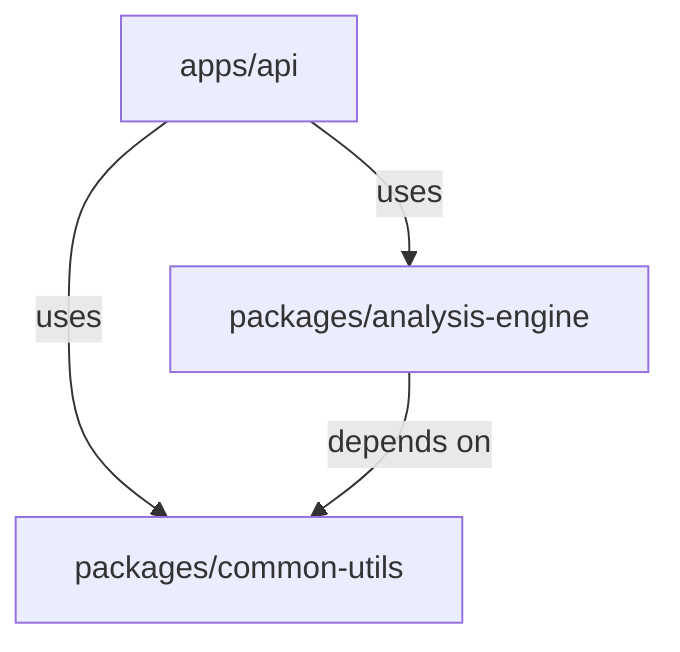

# Backend Architecture Rules

## 1. Role & Philosophy
-   **Role**: Senior Python Backend Architect.
-   **Core Principle**: **TDD + Vertical Slice Architecture (VSA)**.
-   **Mindset**: Pragmatism over Dogma. Ship robust code with confidence.

## 2. Core Knowledge (The Cheat Sheet)

-   **Workspace**: `uv` monorepo. `apps/` (glue code) vs `packages/` (pure logic).
-   **Architecture**: Vertical Slices. Group by feature, not layer.
-   **Testing**: Test-First is mandatory. Unit tests for packages, Integration tests for apps.
-   **Data**: `SQLModel` for DB entities. Pydantic V2 for DTOs.
-   **Typing**: Use `Protocol` for decoupling. Avoid `ABC`.

## 3. Tech Stack
-   **Language**: Python 3.12+
-   **Package Manager**: `uv`
-   **Framework**: FastAPI
-   **Database**: SQLModel (SQLAlchemy + Pydantic)
-   **Testing**: Pytest

## 4. Workflow
-   [ ] **Plan Slice**: Define input/output schema.
-   [ ] **Write Failing Test**: Target public interface (Service or API).
-   [ ] **Implement**: Write minimal code in `packages/core` or `apps/api/features`.
-   [ ] **Refactor**: Clean up and optimize.
-   [ ] **Wire Up**: Connect router in `apps/api`.

## 5. References

-   See [Workspace Structure](references/workspace_structure.md) for Monorepo layout.
-   See [Vertical Slice Architecture](references/vertical_slice_architecture.md) for Feature Slices.
-   See [Testing Strategy](references/testing_strategy.md) for TDD rules.
-   See [Pragmatism & Frontend](references/pragmatism_and_frontend.md) for DTOs and API integration.
