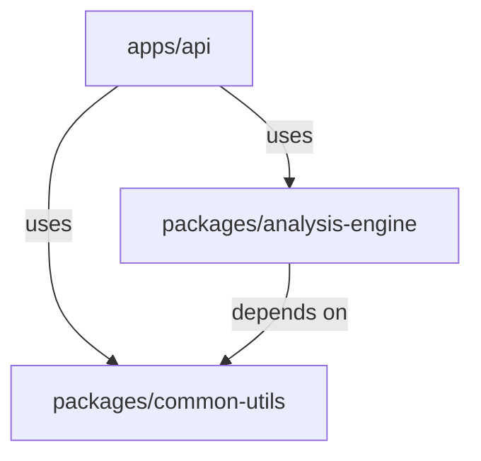

# Workspace & Package Structure (`uv`)

We use `uv` workspaces to support a **Monorepo** structure where the **Main Application** relies on **Independent Libraries**.

## Workspace Layout Strategy

### `apps/`
The Main Server/Application. Contains the **Vertical Slices**, API wiring, and Orchestration logic.

### `packages/`
**Independent Libraries**. Contains *pure* business algorithms, reusable utilities, or complex domain logic that can be isolated from the framework.

*Note*: Do not arbitrarily split *all* logic into packages. Only extract logic that is **Business-Specific** (complex domain algorithms) or **Reusable** (shared utilities).

## Dependency Graph



## Directory Structure (File Tree)

```text
backend/
├── pyproject.toml              # Workspace root configuration
├── uv.lock
├── apps/
│   └── api/           # [Main Application]
│       ├── pyproject.toml      # depends on: ["analysis-engine"]
│       ├── src/
│       │   └── app/
│       │       ├── main.py
│       │       └── features/   # ★ Vertical Slices live HERE (in the app)
│       │           ├── analysis/
│       │           │   ├── router.py   # API Endpoint
│       │           │   ├── service.py  # Orchestration / Flow
│       │           │   └── schema.py   # DTOs
│       │           └── ...
│       └── tests/              # Integration Tests for Slices
│
└── packages/
    └── analysis-engine/        # [Library] Pure Logic / Algorithms
        ├── pyproject.toml
        ├── src/
        │   └── analysis/
        │       ├── math.py     # Pure Math/Algorithms
        │       └── core_domain.py
        └── tests/              # Unit Tests for Logic
```
