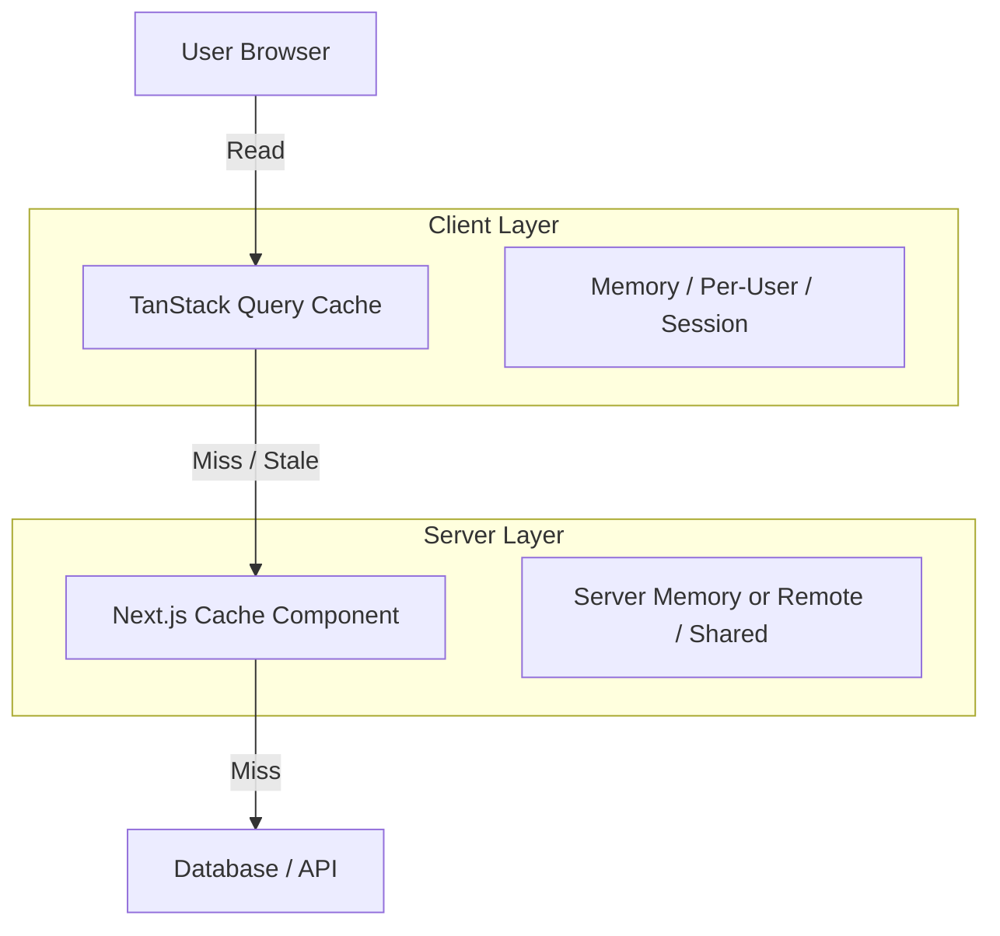

# Integration: TanStack Query & Next.js Cache Components

## Mental Model: The Two-Layer Cache

When using TanStack Query in a Next.js 16+ app with Cache Components, you have two distinct cache layers working in tandem.



## Rules of Engagement

### 1. Separation of Concerns
- **TanStack Query**: Handles **Client Responsiveness**. Immediate UI updates, optimistic UI, polling, window focus refetching.
- **Next.js Cache (`use cache`)**: Handles **Server Load**. Protects the DB/API from excessive calls. Shared across multiple users (if public).

### 2. TTL Coordination
- **Pattern A (Server Strong)**: Server Cache TTL > Client StaleTime. 
    - Client asks frequently, but Server returns cached snapshot instantly.
    - Good for: High traffic public data (e.g., product lists).
- **Pattern B (Client Strong)**: Client StaleTime > Server Cache TTL.
    - Client caches aggressively, rarely hits server. Server always fresh.
    - Good for: User-specific dashboards, admin panels.

### 3. Invalidation Strategy
When a mutation happens (e.g., Update Post), you must invalidate **both** layers if necessary, but usually invalidating the Server Layer is the priority for correctness, while invalidating the Client Layer triggers the UI refresh.

```typescript
// 1. Server Action (Invalidate Server Cache)
'use server'
import { revalidateTag } from 'next/cache'

export async function updatePost(id: string, data: any) {
  await db.update(id, data)
  revalidateTag(`post-${id}`) // Clears 'use cache' entry
}
```

```typescript
// 2. Client Component (Invalidate Client Cache)
'use client'
const mutation = useMutation({
  mutationFn: (data) => updatePostAction(id, data),
  onSuccess: () => {
    // Triggers a new fetch, which will hit the Server
    // Server will fetch fresh data because tag was revalidated
    queryClient.invalidateQueries({ queryKey: ['post', id] })
  }
})
```

## Server-Side Setup (`use cache`)

Simply add `'use cache'` to your data fetching functions that feed the API routes.

```typescript
// query-service.ts
import 'server-only'
import { cacheLife, cacheTag } from 'next/cache'

export async function getPublicPosts() {
  'use cache'
  cacheLife('minutes')
  cacheTag('posts')
  
  return db.post.findMany()
}
```

This function ensures that even if 10,000 clients invalidate their TanStack Query cache simultaneously, the database only sees 1 query per minute.
