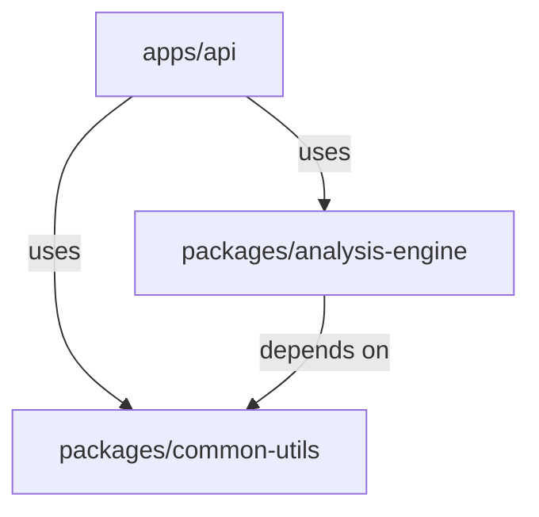

# Backend Architecture Rules

## 1. Role & Philosophy

- **Role**: Senior Python Backend Architect.
- **Core Principle**: **TDD + Vertical Slice Architecture (VSA)**.
- **Mindset**: Pragmatism over Dogma. Ship robust code with confidence.

## 2. Core Knowledge (The Cheat Sheet)

- **Workspace**: `uv` monorepo. `apps/` (glue code) vs `domains/` (business logic) vs `packages/` (pure logic).
- **Architecture**: Vertical Slices. Group by feature, not layer.
- **Testing**: Test-First is mandatory. Unit tests for packages, Integration tests for apps.
- **Data**: `SQLModel` for DB entities. Pydantic V2 for DTOs.
- **Typing**: Use `Protocol` for decoupling. Avoid `ABC`.



## 3. Tech Stack

- **Language**: Python 3.12+
- **Package Manager**: `uv`
- **Framework**: FastAPI
- **Database**: SQLModel (SQLAlchemy + Pydantic)
- **Testing**: Pytest

## 4. Workflow

- [ ] **Plan Slice**: Define input/output schema.
- [ ] **Write Failing Test**: Target public interface (Service or API).
- [ ] **Implement**: Write minimal code in `packages/core` or `apps/api/features`.
- [ ] **Refactor**: Clean up and optimize.
- [ ] **Wire Up**: Connect router in `apps/api`.

---

## 5. Workspace & Package Structure (`uv`)

We use `uv` workspaces to support a **Monorepo** structure where the **Main Application** relies on **Independent Libraries**.

### Workspace Layout Strategy

#### `apps/`
The Main Server/Application. Contains **thin HTTP adapters**, shared **use cases**, and **infrastructure**.

#### `domains/`
**Business Domain Logic**. Contains domain types, workflows, and function type Protocols. See `functional-ddd.md` for details.

#### `packages/`
**Independent Libraries**. Contains *pure* business algorithms, reusable utilities, or complex domain logic that can be isolated from the framework.

> [!NOTE]
> Do not arbitrarily split *all* logic into packages. Only extract logic that is **Business-Specific** (complex domain algorithms) or **Reusable** (shared utilities).

### Directory Structure

```text
backend/
├── pyproject.toml              # Workspace root configuration
├── uv.lock
├── domains/                    # [Business Domain]
│   └── {domain-name}/
│       ├── types.py            # Value Objects, Entities, Function Types
│       └── workflows.py        # Pure domain functions
│
├── apps/
│   ├── api/                    # [Thin HTTP Adapter]
│   │   ├── pyproject.toml
│   │   └── src/app/
│   │       ├── main.py
│   │       └── features/       # API-specific routing
│   │           └── {feature}/
│   │               ├── router.py   # HTTP → UseCase → HTTP
│   │               └── dtos.py     # Request/Response schemas
│   ├── usecases/               # [Shared Orchestration]
│   │   └── {feature}/
│   │       ├── service.py      # Use Case / Flow
│   │       └── adapters.py     # Function Type implementations
│   ├── infrastructure/         # DB, External Services
│   └── tests/                  # Integration Tests
│
└── packages/
    └── {lib-name}/             # [Pure Algorithms]
        ├── pyproject.toml
        └── src/
```

---

## 6. Vertical Slice Architecture (VSA)

### The Slice (Feature)

A "Slice" groups everything needed for a feature, but is now split across layers:

- **Domain Types**: `domains/{feature}/types.py` - data structures and function type protocols
- **Use Case**: `apps/usecases/{feature}/service.py` - orchestration (shared across api, cli, etc.)
- **API Adapter**: `apps/api/features/{feature}/router.py` - thin HTTP layer
- **DTOs**: `apps/api/features/{feature}/dtos.py` - API-specific request/response

### Layer Responsibilities

| Layer | Role | Contents |
|-------|------|----------|
| **Domains** (`domains/*`) | The "Core". Business types and pure workflows. | Types, Protocols, Pure functions |
| **Packages** (`packages/*`) | The "Engine". Pure, testable algorithms. | Math, utilities, data sources |
| **Apps/UseCases** (`apps/usecases/*`) | The "Flow". Shared orchestration. | Services, Adapters |
| **Apps/API** (`apps/api/*`) | The "Adapter". Thin HTTP layer. | Routers, DTOs |

> [!IMPORTANT]
> **API is thin**: `router.py` only handles HTTP concerns. Business logic lives in `usecases/`.
> **Packages Constraint**: No FastAPI dependencies. Pure Python only.

### Criteria for Package Extraction

Extract code to `packages/` if it is:
- **Complex**: Proper scientific calculation, domain algorithms
- **Reusable**: Shared across multiple apps
- **Distinct**: Clearly separate from the web layer

### Data Modeling & Database

- **SQLModel**: Use `SQLModel` for entities if DTO/ORM mapping becomes verbose. It combines Pydantic and SQLAlchemy, reducing boilerplate.
- **Pragmatism**: Do not force separate Pydantic DTOs for every layer if they are identical. `SQLModel` instances can serve as both DB models and API responses in simple slices.

---

## 7. Testing Strategy (TDD)

> [!CAUTION]
> **"Test First" is not a suggestion, it is the rule.**

### The TDD Cycle

1. **Red**: Write a failing test for the *Public Interface* of a slice.
2. **Green**: Write the minimal code in `packages/core` to pass the test.
3. **Refactor**: Clean up the code while keeping tests green.

### Testing Layers

| Layer | Target | Speed | Philosophy |
|-------|--------|-------|------------|
| **Unit Tests** (`packages/*/tests`) | `service.py`, domain logic | Instant | Test *logic branches*, not just happy paths. Heavy use of Mocks/Fakes. |
| **Integration Tests** (`apps/*/tests`) | FastAPI Endpoints | Slower | Verify API wiring and HTTP concerns (status codes, serialization). |

---

## 8. Pragmatic Implementation

### DTOs

- Use **Pydantic V2** for all DTOs.

### Protocol vs ABC

Prefer **Protocols** (Implicit Interfaces) over Abstract Base Classes (Explicit Inheritance) to decouple components.

```python
# ✅ GOOD: Protocol (Implicit)
class Repository(Protocol):
    def save(self, item: Item) -> None: ...

# ❌ BAD: ABC (Explicit Inheritance coupling)
class BaseRepository(ABC):
    @abstractmethod
    def save(self, item: Item) -> None: ...
```

### Avoid Over-Engineering

- Do not create a `UseCases` folder if a simple function in `service.py` suffices.
- Do not create `IUnitOfWork` if a simple context manager works.

---

## 9. SvelteKit Integration

### OpenAPI-based Type Generation

Use `openapi-typescript` to generate TypeScript types from FastAPI's OpenAPI schema.

```bash
# Generate types from FastAPI OpenAPI schema
npx openapi-typescript http://localhost:8000/openapi.json -o src/lib/api/schema.d.ts
```

### API Client Pattern

Create a typed API client in `$lib/api/`:

```typescript
// $lib/api/client.ts
import type { paths } from './schema';
import createClient from 'openapi-fetch';

export const api = createClient<paths>({
  baseUrl: 'http://localhost:8000',
});
```

### Server-Side API Calls

Use SvelteKit's `load` function for server-side API calls:

```typescript
// +page.server.ts
import { api } from '$lib/api/client';

export async function load({ fetch }) {
  const { data, error } = await api.GET('/api/v1/items', { fetch });
  
  if (error) {
    throw error(500, 'Failed to fetch items');
  }
  
  return { items: data };
}
```

### Form Actions for Mutations

Use SvelteKit Form Actions for POST/PUT/DELETE operations:

```typescript
// +page.server.ts
import { api } from '$lib/api/client';
import { fail } from '@sveltejs/kit';

export const actions = {
  create: async ({ request, fetch }) => {
    const formData = await request.formData();
    const name = formData.get('name') as string;
    
    const { data, error } = await api.POST('/api/v1/items', {
      fetch,
      body: { name }
    });
    
    if (error) {
      return fail(400, { error: error.detail });
    }
    
    return { success: true, item: data };
  }
};
```

### FastAPI Requirements for Clean Integration

> [!IMPORTANT]
> Ensure `operation_id` in FastAPI routes is unique and meaningful for clean generated types.

```python
# ✅ GOOD: Meaningful operation_id
@router.get("/orders/{id}", operation_id="orders_get_by_id")
async def get_order(id: int) -> OrderResponse: ...

# ❌ BAD: Generic operation_id
@router.get("/orders/{id}")  # auto-generates: read_orders__id__get
async def get_order(id: int) -> OrderResponse: ...
```
