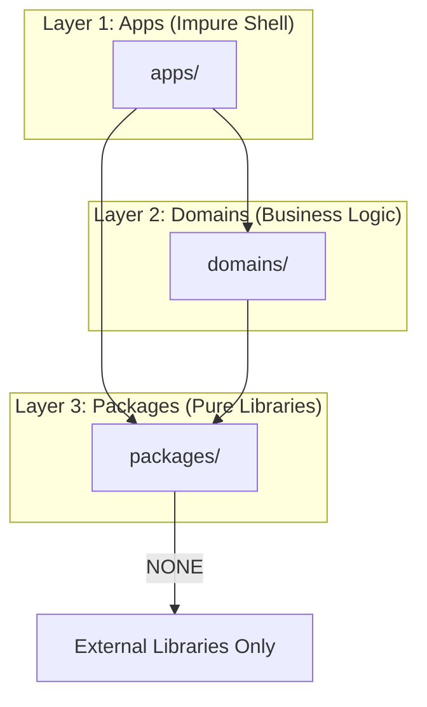

# Functional DDD Architecture

**기반**: Scott Wlaschin의 "Domain Modeling Made Functional" 철학

## 1. 핵심 원칙

### Type-Driven Design

- **타입이 곧 문서**: 타입 시그니처만 보고 동작을 이해할 수 있어야 함
- **불법 상태는 표현 불가능**: 타입 시스템으로 잘못된 상태를 컴파일 타임에 방지
- **Protocol은 타입**: 함수 타입도 타입이므로 `types.py`에 함께 정의

### 순수성과 부수 효과 분리

- **Pure Core, Impure Shell**: 순수 도메인 로직을 중심에, 부수 효과는 가장 바깥에
- **의존성 방향**: 바깥 → 안쪽 (Apps → Domains → Packages)
- **부수 효과 밀어내기**: DB, API 호출 등은 가장 바깥 레이어(Apps)에서만

## 2. 3-Layer Architecture



### 의존성 규칙 (절대적)

| Layer | 의존 가능 | 의존 금지 |
|-------|----------|----------|
| **Apps** | Domains, Packages | - |
| **Domains** | Packages | Apps |
| **Packages** | None (외부 라이브러리만) | Domains, Apps |

### Layer 역할

#### `domains/` - 비즈니스 도메인

순수한 도메인 비즈니스 로직. **각 도메인은 독립된 패키지**로 관리.

```text
domains/
└── {domain-name}/
    ├── pyproject.toml
    └── src/{domain_name}/
        ├── types.py       # Value Objects, Entities, Function Types (Protocol)
        └── workflows.py   # Pure domain workflow functions
```

> [!NOTE]
> **shared/ 폴더 사용 금지**: 도메인 간 공유 타입은 Bounded Context를 오염시킴.
> 정말 공유가 필요하면 `packages/`에 도메인-무관한 primitive로 정의.

#### `packages/` - 순수 함수 라이브러리

도메인에 무관한 순수 함수 라이브러리. numpy, pandas 같은 "직접 만든 라이브러리" 느낌.

```text
packages/
├── {lib-name}/
│   ├── core.py          # Pure algorithms
│   └── utils.py         # Helper functions
└── ...
```

> [!IMPORTANT]
> **Packages Constraints**:
> - 프레임워크 의존 금지 (FastAPI, Django 등)
> - 도메인 타입 import 금지
> - primitive 또는 자체 정의 타입만 사용

#### `apps/` - 애플리케이션 (Impure Shell)

오케스트레이션, Infrastructure, API 엔드포인트. 부수 효과가 발생하는 곳.

```text
apps/
├── api/                     # ★ Thin HTTP Adapter
│   └── features/
│       └── {feature}/
│           ├── router.py    # HTTP → UseCase → HTTP (얇게!)
│           └── dtos.py      # API-specific Request/Response
├── usecases/                # ★ 공유 가능한 오케스트레이션
│   └── {feature}/
│       ├── service.py       # Use Case / Orchestration
│       └── adapters.py      # Function Type 구현체
├── infrastructure/          # DB, External Services (앱 간 공유)
└── shared/                  # 공통 의존성
```

> [!NOTE]
> **API는 thin하게**: `router.py`는 HTTP 변환만. 비즈니스 로직은 `usecases/`에.
> CLI, Worker 등 다른 앱도 `usecases/`를 공유 가능.

## 3. 타입 설계 원칙

### Value Object & Entity: Pydantic + frozen

```python
from pydantic import BaseModel, ConfigDict

class TickerId(BaseModel):
    """Value Object: 불변, 동등성으로 비교"""
    model_config = ConfigDict(frozen=True)
    
    symbol: str
    country: str

class Ticker(BaseModel):
    """Entity: 불변, ID로 식별"""
    model_config = ConfigDict(frozen=True)
    
    id: TickerId
    name_ko: str | None
    market_type: str
```

### Function Type: Protocol as Type

Protocol을 함수 타입으로 취급. `types.py`에 함께 정의.

```python
from typing import Protocol

class FetchPrices(Protocol):
    """가격 조회 함수 타입"""
    def __call__(
        self,
        tickers: list[TickerId],
        start_date: str,
        end_date: str,
    ) -> dict[str, list[PriceData]]: ...
```

> [!NOTE]
> **ports.py 분리 불필요**: Protocol도 타입이므로 `types.py`에 통합.
> 가독성을 위해 Protocol 문법 유지, 개념적으로는 함수 타입으로 취급.

### Repository 대신 개별 함수 타입

Repository 클래스 대신 **개별 함수 타입**을 사용. 필요한 것만 주입.

```python
# ✅ GOOD: 개별 함수 타입
class GetTickerById(Protocol):
    def __call__(self, id: str) -> Ticker | None: ...

class SaveTicker(Protocol):
    def __call__(self, ticker: Ticker) -> None: ...

# 필요한 함수만 주입
def some_workflow(get_ticker: GetTickerById):
    ticker = get_ticker("AAPL")

# ❌ BAD: Repository 클래스 (여러 작업 결합)
class TickerRepository(Protocol):
    def get_by_id(self, id: str) -> Ticker: ...
    def save(self, ticker: Ticker) -> None: ...
    def delete(self, id: str) -> None: ...
```

### Command: Immutable Request Object

```python
from dataclasses import dataclass

@dataclass(frozen=True)
class CalculateMomentumCmd:
    """Command: 불변 요청 객체"""
    tickers: tuple[TickerId, ...]
    lookback_days: int = 20
    top_n: int = 20
```

## 4. 변환 로직 소유권

> [!IMPORTANT]
> **Domain이 변환 소유**: Domain은 DTO 타입을 모름. primitive dict를 반환.

### 원칙

- **Domain → DTO**: Domain이 `to_dict()` 같은 함수로 primitive 반환
- **DTO → Domain**: Domain이 factory 함수로 primitive 받아 Domain 생성
- **독립 함수 선호**: 클래스 메서드보다 독립 함수가 테스트/조합 용이

### 예시

```python
# domains/{domain}/types.py
class Ticker(BaseModel):
    model_config = ConfigDict(frozen=True)
    symbol: str
    name_ko: str | None
    country: str

# 변환 함수: 도메인이 소유, primitive 반환
def ticker_to_response_dict(ticker: Ticker) -> dict:
    """Domain → primitive (DTO용)"""
    return {
        "ticker": ticker.symbol,
        "name": ticker.name_ko or ticker.symbol,
        "country": ticker.country
    }

def create_ticker(symbol: str, country: str, name_ko: str | None = None) -> Ticker:
    """primitive → Domain"""
    return Ticker(symbol=symbol, country=country, name_ko=name_ko)
```

```python
# apps/api/features/{feature}/schemas.py
class TickerResponse(BaseModel):
    ticker: str
    name: str
    country: str | None

# apps/api/features/{feature}/router.py
from domains.ticker.types import ticker_to_response_dict

def get_ticker(...) -> TickerResponse:
    domain_obj = ...
    return TickerResponse(**ticker_to_response_dict(domain_obj))
```

## 5. Anti-Patterns

| ❌ 하지 말 것 | ✅ 대신 이렇게 |
|--------------|---------------|
| DTO가 packages에 위치 | DTO는 apps/api/features/{feature}/dtos.py에 |
| Domain이 DTO 타입 import | Domain은 primitive dict 반환 |
| 클래스 메서드로 변환 | 독립 함수로 변환 |
| ABC로 인터페이스 정의 | Protocol로 정의 |
| packages에 Infrastructure 코드 | apps/infrastructure/에 위치 |
| API router에 비즈니스 로직 | apps/usecases/에서 오케스트레이션 |
| 하나의 거대 공유 도메인 | 기능별 독립 도메인 |

## 6. 설계 결정 흐름

```
새로운 기능 구현 시:
1. 어떤 타입이 필요한가? → domains/{domain}/types.py (또는 단일 파일)
2. 순수 도메인 로직인가? → domains/{domain}/workflows.py
3. 외부 시스템 호출인가? → apps/usecases/{feature}/adapters.py
4. API 엔드포인트인가? → apps/api/features/{feature}/router.py
5. DTO가 필요한가? → apps/api/features/{feature}/dtos.py
```

